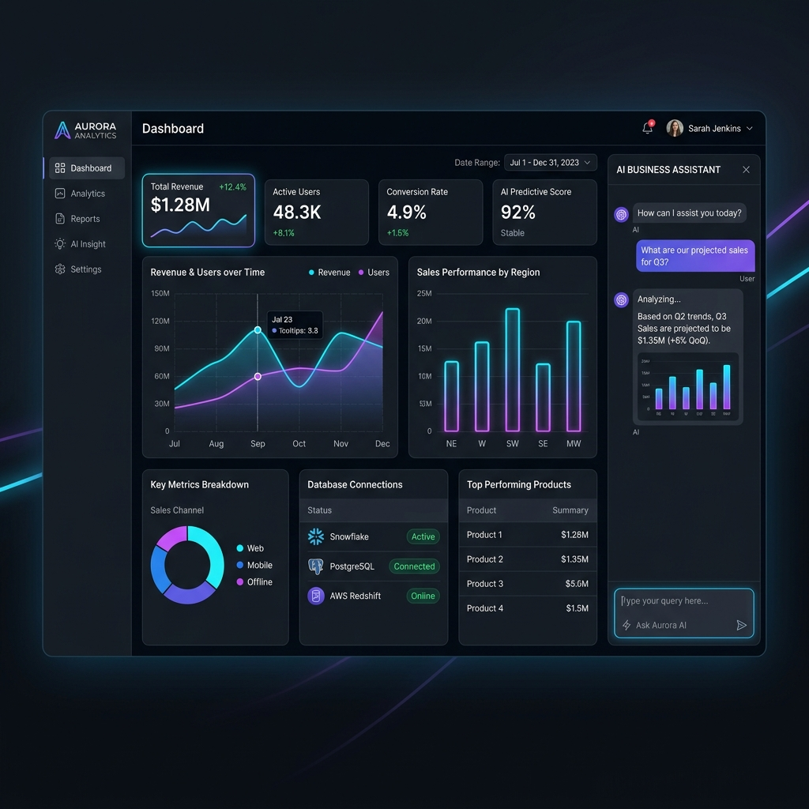

# Power AI BI Assistant 📊

An advanced, premium-tier AI-powered Business Intelligence platform that empowers users to query databases, analyze file uploads, generate predictive forecasts, and visualize complex data structures using natural language.

---

## 🖥️ Platform Preview



---

## ✨ Features

- **Dual Frontend Interfaces**:
  - **Streamlit Dashboard** (`frontend/app.py`): A premium dashboard featuring interactive KPI metric cards, database connection panels, and integrated chat.
  - **Vite + React Web App** (`frontend/src/`): A modern, high-performance conversational web interface written in React and TypeScript.
- **Intelligent Intent & Routing Engine**: Automatically classifies query intent and routes natural language requests to the correct handler (database queries, custom file uploads, sales forecasting, or charting).
- **Cross-Database SQL Generator**: Translates natural language into optimized SQL queries for both **PostgreSQL** and **MySQL** schemas with validation checks.
- **Universal File Processing**: Allows users to upload and parse CSVs, Excel sheets, and PDFs to extract meaningful insights on the fly.
- **Sales & Trend Forecasting**: Detects forecasting intent and applies predictive analytics to sales metrics to forecast future trends.
- **Dynamic Charts**: Instantly renders clean, interactive data visualizations based on query results.

---

## 🛠️ Tech Stack

- **Backend Logic**: Python 3.10+, Pandas, NumPy, Statsmodels, Scikit-learn
- **Database Layer**: SQLAlchemy, PyMySQL, Psycopg2 (MySQL and PostgreSQL support)
- **Frontend Frameworks**: Streamlit (Python) and React 18 + TypeScript + Vite
- **Integrations**: MCP (Model Context Protocol) Server for backend service exposition, Ollama / OpenAI API for LLM reasoning fallback

---

## 🚀 Getting Started

### 1. Database Setup

Initialize your local databases (PostgreSQL or MySQL) with the schema provided:
```bash
# For PostgreSQL/MySQL, run the SQL script to seed database tables:
# database/schema.sql
```

### 2. Backend & Streamlit Setup

1. **Create and activate a virtual environment**:
   ```bash
   python -m venv venv
   # Windows:
   venv\Scripts\activate
   # macOS/Linux:
   source venv/bin/activate
   ```

2. **Install requirements** (if not already installed):
   ```bash
   pip install -r backend/requirements.txt  # Or manually install pandas, streamlit, requests, psycopg2, pymysql
   ```

3. **Run the Streamlit Dashboard**:
   ```bash
   streamlit run frontend/app.py
   ```

### 3. React Frontend Setup (Vite)

1. Navigate to the frontend directory:
   ```bash
   cd frontend
   ```

2. Install dependencies:
   ```bash
   npm install
   ```

3. Run the development server:
   ```bash
   npm run dev
   ```

---

## 📁 Repository Structure

- `backend/`: Core logic engines for intent classification, SQL generation, forecasting, and the MCP server.
- `database/`: Database initialization scripts (`schema.sql`).
- `frontend/`: Dual frontends—Streamlit (`app.py`) and the React web app codebase.
- `static/`: Static resources and dashboard mockup assets.
- `visualization/`: Visualization utilities and chart generation tools.
